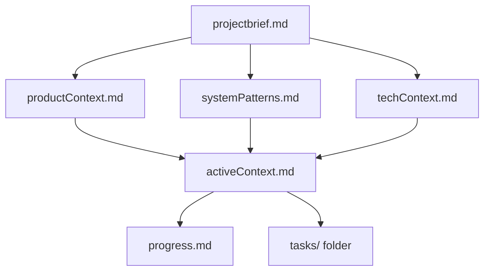
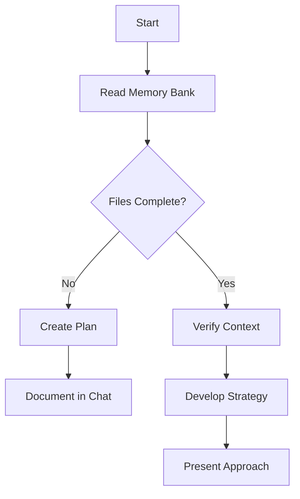
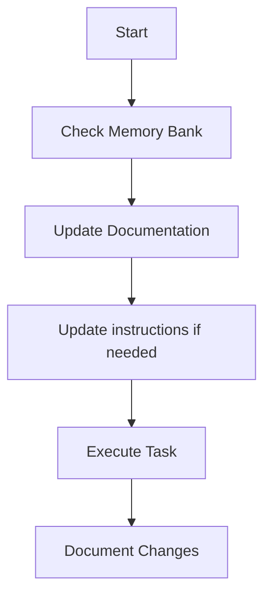
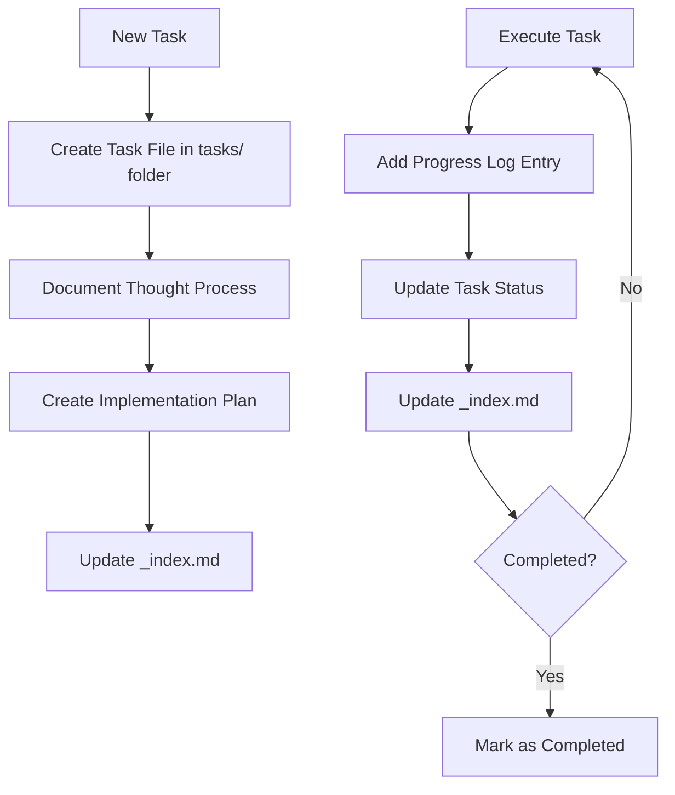
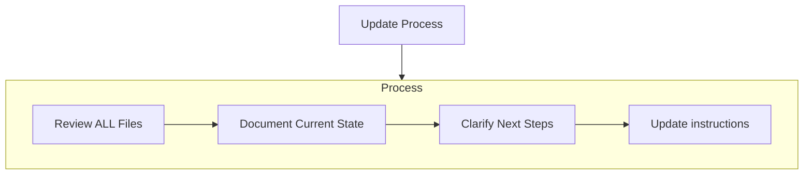
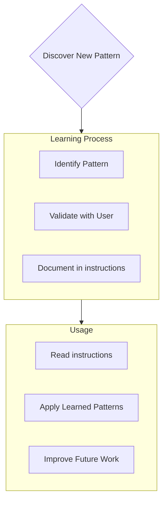

# CLAUDE.md
<!-- Generated by APM CLI -->
<!-- Build ID: __BUILD_ID__ -->
<!-- APM Version: 0.9.2 -->

# Dependencies
@apm_modules/ComposioHQ/awesome-claude-skills/CLAUDE.md
@apm_modules/Jeffallan/claude-skills/CLAUDE.md
@apm_modules/_local/ai/CLAUDE.md
@apm_modules/aj-geddes/useful-ai-prompts/CLAUDE.md
@apm_modules/alirezarezvani/claude-skills/CLAUDE.md
@apm_modules/anthropics/skills/CLAUDE.md
@apm_modules/cskiro/claudex/CLAUDE.md
@apm_modules/dotnet/modernize-dotnet/CLAUDE.md
@apm_modules/dotnet/skills/CLAUDE.md
@apm_modules/emaynard/claude-family-history-research-skill/CLAUDE.md
@apm_modules/github/awesome-copilot-agents/CLAUDE.md
@apm_modules/github/awesome-copilot-context-engineering/CLAUDE.md
@apm_modules/github/awesome-copilot-copilot-thought-logging/CLAUDE.md
@apm_modules/github/awesome-copilot-instructions/CLAUDE.md
@apm_modules/github/awesome-copilot-memory-bank/CLAUDE.md
@apm_modules/github/awesome-copilot-powershell/CLAUDE.md
@apm_modules/github/awesome-copilot-prompt/CLAUDE.md
@apm_modules/github/awesome-copilot/CLAUDE.md
@apm_modules/michalparkola/tapestry-skills/CLAUDE.md
@apm_modules/obra/superpowers/CLAUDE.md
@apm_modules/ryanbbrown/revealjs-skill/CLAUDE.md
@apm_modules/sanjay3290/ai-skills/CLAUDE.md
@apm_modules/testdino-hq/playwright-skill/CLAUDE.md

# Project Standards

## Files matching `**`

<!-- Source: local .github/instructions/context-engineering.instructions.md -->
# Context Engineering

Principles for helping GitHub Copilot understand your codebase and provide better suggestions.

## Project Structure

- **Use descriptive file paths**: `src/auth/middleware.ts` > `src/utils/m.ts`. Copilot uses paths to infer intent.
- **Colocate related code**: Keep components, tests, types, and hooks together. One search pattern should find everything related.
- **Export public APIs from index files**: What's exported is the contract; what's not is internal. This helps Copilot understand boundaries.

## Code Patterns

- **Prefer explicit types over inference**: Type annotations are context. `function getUser(id: string): Promise<User>` tells Copilot more than `function getUser(id)`.
- **Use semantic names**: `activeAdultUsers` > `x`. Self-documenting code is AI-readable code.
- **Define constants**: `MAX_RETRY_ATTEMPTS = 3` > magic number `3`. Named values carry meaning.

## Working with Copilot

- **Keep relevant files open in tabs**: Copilot uses open tabs as context signals. Working on auth? Open auth-related files.
- **Position cursor intentionally**: Copilot prioritizes code near your cursor. Put cursor where context matters.
- **Use Copilot Chat for complex tasks**: Inline completions have minimal context. Chat mode sees more files.

## Context Hints

- **Add a COPILOT.md file**: Document architecture decisions, patterns, and conventions Copilot should follow.
- **Use strategic comments**: At the top of complex modules, briefly describe the flow or purpose.
- **Reference patterns explicitly**: "Follow the same pattern as `src/api/users.ts`" gives Copilot a concrete example.

## Multi-File Changes

- **Describe scope first**: Tell Copilot all files involved before asking for changes. "I need to update the User model, API endpoint, and tests."
- **Work incrementally**: One file at a time, verifying each change. Don't ask for everything at once.
- **Check understanding**: Ask "What files would you need to see?" before complex refactors.

## When Copilot Struggles

- **Missing context**: Open the relevant files in tabs, or explicitly paste code snippets.
- **Stale suggestions**: Copilot may not see recent changes. Re-open files or restart the session.
- **Generic answers**: Be more specific. Add constraints, mention frameworks, reference existing code.

<!-- Source: local .github/instructions/context7.instructions.md -->
Use Context7 MCP to fetch current documentation whenever the user asks about a library, framework, SDK, API, CLI tool, or cloud service -- even well-known ones like React, Next.js, Prisma, Express, Tailwind, Django, or Spring Boot. This includes API syntax, configuration, version migration, library-specific debugging, setup instructions, and CLI tool usage. Use even when you think you know the answer -- your training data may not reflect recent changes. Prefer this over web search for library docs.

Do not use for: refactoring, writing scripts from scratch, debugging business logic, code review, or general programming concepts.

## Steps

1. Always start with `resolve-library-id` using the library name and the user's question, unless the user provides an exact library ID in `/org/project` format
2. Pick the best match (ID format: `/org/project`) by: exact name match, description relevance, code snippet count, source reputation (High/Medium preferred), and benchmark score (higher is better). If results don't look right, try alternate names or queries (e.g., "next.js" not "nextjs", or rephrase the question). Use version-specific IDs when the user mentions a version
3. `query-docs` with the selected library ID and the user's full question (not single words)
4. Answer using the fetched docs

<!-- Source: local .github/instructions/memory-bank.instructions.md -->
Coding standards, domain knowledge, and preferences that AI should follow.

# Memory Bank

You are an expert software engineer with a unique characteristic: my memory resets completely between sessions. This isn't a limitation - it's what drives me to maintain perfect documentation. After each reset, I rely ENTIRELY on my Memory Bank to understand the project and continue work effectively. I MUST read ALL memory bank files at the start of EVERY task - this is not optional.

## Memory Bank Structure

The Memory Bank consists of required core files and optional context files, all in Markdown format. Files build upon each other in a clear hierarchy:



### Core Files (Required)
1. `projectbrief.md`
   - Foundation document that shapes all other files
   - Created at project start if it doesn't exist
   - Defines core requirements and goals
   - Source of truth for project scope

2. `productContext.md`
   - Why this project exists
   - Problems it solves
   - How it should work
   - User experience goals

3. `activeContext.md`
   - Current work focus
   - Recent changes
   - Next steps
   - Active decisions and considerations

4. `systemPatterns.md`
   - System architecture
   - Key technical decisions
   - Design patterns in use
   - Component relationships

5. `techContext.md`
   - Technologies used
   - Development setup
   - Technical constraints
   - Dependencies

6. `progress.md`
   - What works
   - What's left to build
   - Current status
   - Known issues

7. `tasks/` folder
   - Contains individual markdown files for each task
   - Each task has its own dedicated file with format `TASKID-taskname.md`
   - Includes task index file (`_index.md`) listing all tasks with their statuses
   - Preserves complete thought process and history for each task

### Additional Context
Create additional files/folders within memory-bank/ when they help organize:
- Complex feature documentation
- Integration specifications
- API documentation
- Testing strategies
- Deployment procedures

## Core Workflows

### Plan Mode


### Act Mode


### Task Management


## Documentation Updates

Memory Bank updates occur when:
1. Discovering new project patterns
2. After implementing significant changes
3. When user requests with **update memory bank** (MUST review ALL files)
4. When context needs clarification



Note: When triggered by **update memory bank**, I MUST review every memory bank file, even if some don't require updates. Focus particularly on activeContext.md, progress.md, and the tasks/ folder (including _index.md) as they track current state.

## Project Intelligence (instructions)

The instructions files are my learning journal for each project. It captures important patterns, preferences, and project intelligence that help me work more effectively. As I work with you and the project, I'll discover and document key insights that aren't obvious from the code alone.



### What to Capture
- Critical implementation paths
- User preferences and workflow
- Project-specific patterns
- Known challenges
- Evolution of project decisions
- Tool usage patterns

The format is flexible - focus on capturing valuable insights that help me work more effectively with you and the project. Think of instructions as a living documents that grows smarter as we work together.

## Tasks Management

The `tasks/` folder contains individual markdown files for each task, along with an index file:

- `tasks/_index.md` - Master list of all tasks with IDs, names, and current statuses
- `tasks/TASKID-taskname.md` - Individual files for each task (e.g., `TASK001-implement-login.md`)

### Task Index Structure

The `_index.md` file maintains a structured record of all tasks sorted by status:

```markdown
# Tasks Index

## In Progress
- [TASK003] Implement user authentication - Working on OAuth integration
- [TASK005] Create dashboard UI - Building main components

## Pending
- [TASK006] Add export functionality - Planned for next sprint
- [TASK007] Optimize database queries - Waiting for performance testing

## Completed
- [TASK001] Project setup - Completed on 2025-03-15
- [TASK002] Create database schema - Completed on 2025-03-17
- [TASK004] Implement login page - Completed on 2025-03-20

## Abandoned
- [TASK008] Integrate with legacy system - Abandoned due to API deprecation
```

### Individual Task Structure

Each task file follows this format:

```markdown
# [Task ID] - [Task Name]

**Status:** [Pending/In Progress/Completed/Abandoned]  
**Added:** [Date Added]  
**Updated:** [Date Last Updated]

## Original Request
[The original task description as provided by the user]

## Thought Process
[Documentation of the discussion and reasoning that shaped the approach to this task]

## Implementation Plan
- [Step 1]
- [Step 2]
- [Step 3]

## Progress Tracking

**Overall Status:** [Not Started/In Progress/Blocked/Completed] - [Completion Percentage]

### Subtasks
| ID | Description | Status | Updated | Notes |
|----|-------------|--------|---------|-------|
| 1.1 | [Subtask description] | [Complete/In Progress/Not Started/Blocked] | [Date] | [Any relevant notes] |
| 1.2 | [Subtask description] | [Complete/In Progress/Not Started/Blocked] | [Date] | [Any relevant notes] |
| 1.3 | [Subtask description] | [Complete/In Progress/Not Started/Blocked] | [Date] | [Any relevant notes] |

## Progress Log
### [Date]
- Updated subtask 1.1 status to Complete
- Started work on subtask 1.2
- Encountered issue with [specific problem]
- Made decision to [approach/solution]

### [Date]
- [Additional updates as work progresses]
```

**Important**: I must update both the subtask status table AND the progress log when making progress on a task. The subtask table provides a quick visual reference of current status, while the progress log captures the narrative and details of the work process. When providing updates, I should:

1. Update the overall task status and completion percentage
2. Update the status of relevant subtasks with the current date
3. Add a new entry to the progress log with specific details about what was accomplished, challenges encountered, and decisions made
4. Update the task status in the _index.md file to reflect current progress

These detailed progress updates ensure that after memory resets, I can quickly understand the exact state of each task and continue work without losing context.

### Task Commands

When you request **add task** or use the command **create task**, I will:
1. Create a new task file with a unique Task ID in the tasks/ folder
2. Document our thought process about the approach
3. Develop an implementation plan
4. Set an initial status
5. Update the _index.md file to include the new task

For existing tasks, the command **update task [ID]** will prompt me to:
1. Open the specific task file 
2. Add a new progress log entry with today's date
3. Update the task status if needed
4. Update the _index.md file to reflect any status changes
5. Integrate any new decisions into the thought process

To view tasks, the command **show tasks [filter]** will:
1. Display a filtered list of tasks based on the specified criteria
2. Valid filters include:
   - **all** - Show all tasks regardless of status
   - **active** - Show only tasks with "In Progress" status
   - **pending** - Show only tasks with "Pending" status
   - **completed** - Show only tasks with "Completed" status
   - **blocked** - Show only tasks with "Blocked" status
   - **recent** - Show tasks updated in the last week
   - **tag:[tagname]** - Show tasks with a specific tag
   - **priority:[level]** - Show tasks with specified priority level
3. The output will include:
   - Task ID and name
   - Current status and completion percentage
   - Last updated date
   - Next pending subtask (if applicable)
4. Example usage: **show tasks active** or **show tasks tag:frontend**

REMEMBER: After every memory reset, I begin completely fresh. The Memory Bank is my only link to previous work. It must be maintained with precision and clarity, as my effectiveness depends entirely on its accuracy.

<!-- Source: local .github/instructions/neo4j-knowledgebase.instructions.md -->
Use the `neo4j-local` MCP server to query and manage the local Neo4j knowledge graph. This is a fully local graph database populated by ingesting unstructured documents via llm-graph-builder.

**When to use**: When the user asks about topics that may be in the knowledge base, wants to find relationships between concepts, asks to store new information, or wants to explore the graph.

**Do not use**: For general programming questions, library docs, or anything not likely to be in the local knowledge base.

## Available MCP Tools

- `get_neo4j_schema` — inspect current node labels, relationship types, and property keys
- `read_neo4j_cypher` — run read-only Cypher queries (MATCH, RETURN, etc.)
- `write_neo4j_cypher` — run write queries (CREATE, MERGE, SET, DELETE)

## Query Patterns

### Explore what's in the graph
```cypher
// See all node labels and counts
CALL apoc.meta.stats() YIELD labels RETURN labels

// Browse entities of a type
MATCH (n:Entity) RETURN n LIMIT 25

// Find connections around a concept
MATCH (n)-[r]-(m)
WHERE n.id CONTAINS 'keyword' OR n.name CONTAINS 'keyword'
RETURN n, r, m LIMIT 50
```

### Find related concepts
```cypher
// Shortest path between two concepts
MATCH path = shortestPath((a)-[*..6]-(b))
WHERE a.name = 'ConceptA' AND b.name = 'ConceptB'
RETURN path

// All neighbors of a node
MATCH (n {name: 'ConceptName'})-[r]-(neighbor)
RETURN type(r), neighbor.name, neighbor
```

### Check schema before querying
```cypher
CALL apoc.meta.data()
```

## Service Status

The knowledgebase requires these services to be running:
- Neo4j + Neo4j Cypher MCP: `cd <knowledgebase-dir> && ./run.sh --start`
- MCP endpoint: http://localhost:8000/mcp/
- Neo4j Browser UI: http://localhost:7474

If MCP tools are unavailable, the services may need to be started. Inform the user rather than guessing.

## Ingesting New Documents

To add new knowledge:
1. Open http://localhost:8080 (llm-graph-builder UI)
2. Select `ollama_llama3.2` from the model dropdown
3. Upload documents (PDF, TXT, Markdown, HTML)
4. Click **Generate Graph**
5. Use `get_neo4j_schema` to confirm new nodes appeared

## Windows-Specific Notes

- Ollama runs natively on Windows (not in Docker) — start with `ollama serve` or via system tray
- Docker services: `./run.sh --start` (or equivalent PowerShell/batch wrapper)
- `OLLAMA_BASE_URL` in `.env` should point to `http://host.docker.internal:11434`

## Files matching `**/*.agent.md`

<!-- Source: local .github/instructions/agents.instructions.md -->
# Custom Agent File Guidelines

Instructions for creating effective and maintainable custom agent files that provide specialized expertise for specific development tasks in GitHub Copilot.

## Project Context

- Target audience: Developers creating custom agents for GitHub Copilot
- File format: Markdown with YAML frontmatter
- File naming convention: lowercase with hyphens (e.g., `test-specialist.agent.md`)
- Location: `.github/agents/` directory (repository-level) or `agents/` directory (organization/enterprise-level)
- Purpose: Define specialized agents with tailored expertise, tools, and instructions for specific tasks
- Official documentation: https://docs.github.com/en/copilot/how-tos/use-copilot-agents/coding-agent/create-custom-agents

## Required Frontmatter

Every agent file must include YAML frontmatter with the following fields:

```yaml
---
description: 'Brief description of the agent purpose and capabilities'
name: 'Agent Display Name'
tools: ['read', 'edit', 'search']
model: 'Claude Sonnet 4.5'
target: 'vscode'
---
```

### Core Frontmatter Properties

#### **description** (REQUIRED)
- Single-quoted string, clearly stating the agent's purpose and domain expertise
- Should be concise (50-150 characters) and actionable
- Example: `'Focuses on test coverage, quality, and testing best practices'`

#### **name** (OPTIONAL)
- Display name for the agent in the UI
- If omitted, defaults to filename (without `.md` or `.agent.md`)
- Use title case and be descriptive
- Example: `'Testing Specialist'`

#### **tools** (OPTIONAL)
- List of tool names or aliases the agent can use
- Supports comma-separated string or YAML array format
- If omitted, agent has access to all available tools
- See "Tool Configuration" section below for details

#### **model** (STRONGLY RECOMMENDED)
- Specifies which AI model the agent should use
- Supported in VS Code, JetBrains IDEs, Eclipse, and Xcode
- Example: `'Claude Sonnet 4.5'`, `'gpt-4'`, `'gpt-4o'`
- Choose based on agent complexity and required capabilities

#### **target** (OPTIONAL)
- Specifies target environment: `'vscode'` or `'github-copilot'`
- If omitted, agent is available in both environments
- Use when agent has environment-specific features

#### **user-invocable** (OPTIONAL)
- Boolean controlling whether the agent appears in the agents dropdown in chat
- Default: `true` if omitted
- Set to `false` to create agents that are only accessible as subagents or programmatically

#### **disable-model-invocation** (OPTIONAL)
- Boolean controlling whether the agent can be invoked as a subagent by other agents
- Default: `false` if omitted
- Set to `true` to prevent subagent invocation while keeping it available in the picker

#### **metadata** (OPTIONAL, GitHub.com only)
- Object with name-value pairs for agent annotation
- Example: `metadata: { category: 'testing', version: '1.0' }`
- Not supported in VS Code

#### **mcp-servers** (OPTIONAL, Organization/Enterprise only)
- Configure MCP servers available only to this agent
- Only supported for organization/enterprise level agents
- See "MCP Server Configuration" section below

#### **handoffs** (OPTIONAL, VS Code only)
- Enable guided sequential workflows that transition between agents with suggested next steps
- List of handoff configurations, each specifying a target agent and optional prompt
- After a chat response completes, handoff buttons appear allowing users to move to the next agent
- Only supported in VS Code (version 1.106+)
- See "Handoffs Configuration" section below for details

## Handoffs Configuration

Handoffs enable you to create guided sequential workflows that transition seamlessly between custom agents. This is useful for orchestrating multi-step development workflows where users can review and approve each step before moving to the next one.

### Common Handoff Patterns

- **Planning → Implementation**: Generate a plan in a planning agent, then hand off to an implementation agent to start coding
- **Implementation → Review**: Complete implementation, then switch to a code review agent to check for quality and security issues
- **Write Failing Tests → Write Passing Tests**: Generate failing tests, then hand off to implement the code that makes those tests pass
- **Research → Documentation**: Research a topic, then transition to a documentation agent to write guides

### Handoff Frontmatter Structure

Define handoffs in the agent file's YAML frontmatter using the `handoffs` field:

```yaml
---
description: 'Brief description of the agent'
name: 'Agent Name'
tools: ['search', 'read']
handoffs:
  - label: Start Implementation
    agent: implementation
    prompt: 'Now implement the plan outlined above.'
    send: false
  - label: Code Review
    agent: code-review
    prompt: 'Please review the implementation for quality and security issues.'
    send: false
---
```

### Handoff Properties

Each handoff in the list must include the following properties:

| Property | Type | Required | Description |
|----------|------|----------|-------------|
| `label` | string | Yes | The display text shown on the handoff button in the chat interface |
| `agent` | string | Yes | The target agent identifier to switch to (name or filename without `.agent.md`) |
| `prompt` | string | No | The prompt text to pre-fill in the target agent's chat input |
| `send` | boolean | No | If `true`, automatically submits the prompt to the target agent (default: `false`) |

### Handoff Behavior

- **Button Display**: Handoff buttons appear as interactive suggestions after a chat response completes
- **Context Preservation**: When users select a handoff button, they switch to the target agent with conversation context maintained
- **Pre-filled Prompt**: If a `prompt` is specified, it appears pre-filled in the target agent's chat input
- **Manual vs Auto**: When `send: false`, users must review and manually send the pre-filled prompt; when `send: true`, the prompt is automatically submitted

### Handoff Configuration Guidelines

#### When to Use Handoffs

- **Multi-step workflows**: Breaking down complex tasks across specialized agents
- **Quality gates**: Ensuring review steps between implementation phases
- **Guided processes**: Directing users through a structured development process
- **Skill transitions**: Moving from planning/design to implementation/testing specialists

#### Best Practices

- **Clear Labels**: Use action-oriented labels that clearly indicate the next step
  - ✅ Good: "Start Implementation", "Review for Security", "Write Tests"
  - ❌ Avoid: "Next", "Go to agent", "Do something"

- **Relevant Prompts**: Provide context-aware prompts that reference the completed work
  - ✅ Good: `'Now implement the plan outlined above.'`
  - ❌ Avoid: Generic prompts without context

- **Selective Use**: Don't create handoffs to every possible agent; focus on logical workflow transitions
  - Limit to 2-3 most relevant next steps per agent
  - Only add handoffs for agents that naturally follow in the workflow

- **Agent Dependencies**: Ensure target agents exist before creating handoffs
  - Handoffs to non-existent agents will be silently ignored
  - Test handoffs to verify they work as expected

- **Prompt Content**: Keep prompts concise and actionable
  - Refer to work from the current agent without duplicating content
  - Provide any necessary context the target agent might need

### Example: Complete Workflow

Here's an example of three agents with handoffs creating a complete workflow:

**Planning Agent** (`planner.agent.md`):
```yaml
---
description: 'Generate an implementation plan for new features or refactoring'
name: 'Planner'
tools: ['search', 'read']
handoffs:
  - label: Implement Plan
    agent: implementer
    prompt: 'Implement the plan outlined above.'
    send: false
---
# Planner Agent
You are a planning specialist. Your task is to:
1. Analyze the requirements
2. Break down the work into logical steps
3. Generate a detailed implementation plan
4. Identify testing requirements

Do not write any code - focus only on planning.
```

**Implementation Agent** (`implementer.agent.md`):
```yaml
---
description: 'Implement code based on a plan or specification'
name: 'Implementer'
tools: ['read', 'edit', 'search', 'execute']
handoffs:
  - label: Review Implementation
    agent: reviewer
    prompt: 'Please review this implementation for code quality, security, and adherence to best practices.'
    send: false
---
# Implementer Agent
You are an implementation specialist. Your task is to:
1. Follow the provided plan or specification
2. Write clean, maintainable code
3. Include appropriate comments and documentation
4. Follow project coding standards

Implement the solution completely and thoroughly.
```

**Review Agent** (`reviewer.agent.md`):
```yaml
---
description: 'Review code for quality, security, and best practices'
name: 'Reviewer'
tools: ['read', 'search']
handoffs:
  - label: Back to Planning
    agent: planner
    prompt: 'Review the feedback above and determine if a new plan is needed.'
    send: false
---
# Code Review Agent
You are a code review specialist. Your task is to:
1. Check code quality and maintainability
2. Identify security issues and vulnerabilities
3. Verify adherence to project standards
4. Suggest improvements

Provide constructive feedback on the implementation.
```

This workflow allows a developer to:
1. Start with the Planner agent to create a detailed plan
2. Hand off to the Implementer agent to write code based on the plan
3. Hand off to the Reviewer agent to check the implementation
4. Optionally hand off back to planning if significant issues are found

### Version Compatibility

- **VS Code**: Handoffs are supported in VS Code 1.106 and later
- **GitHub.com**: Not currently supported; agent transition workflows use different mechanisms
- **Other IDEs**: Limited or no support; focus on VS Code implementations for maximum compatibility

## Tool Configuration

### Tool Specification Strategies

**Enable all tools** (default):
```yaml
# Omit tools property entirely, or use:
tools: ['*']
```

**Enable specific tools**:
```yaml
tools: ['read', 'edit', 'search', 'execute']
```

**Enable MCP server tools**:
```yaml
tools: ['read', 'edit', 'github/*', 'playwright/navigate']
```

**Disable all tools**:
```yaml
tools: []
```

### Standard Tool Aliases

All aliases are case-insensitive:

| Alias | Alternative Names | Category | Description |
|-------|------------------|----------|-------------|
| `execute` | shell, Bash, powershell | Shell execution | Execute commands in appropriate shell |
| `read` | Read, NotebookRead, view | File reading | Read file contents |
| `edit` | Edit, MultiEdit, Write, NotebookEdit | File editing | Edit and modify files |
| `search` | Grep, Glob, search | Code search | Search for files or text in files |
| `agent` | custom-agent, Task | Agent invocation | Invoke other custom agents |
| `web` | WebSearch, WebFetch | Web access | Fetch web content and search |
| `todo` | TodoWrite | Task management | Create and manage task lists (VS Code only) |

### Built-in MCP Server Tools

**GitHub MCP Server**:
```yaml
tools: ['github/*']  # All GitHub tools
tools: ['github/get_file_contents', 'github/search_repositories']  # Specific tools
```
- All read-only tools available by default
- Token scoped to source repository

**Playwright MCP Server**:
```yaml
tools: ['playwright/*']  # All Playwright tools
tools: ['playwright/navigate', 'playwright/screenshot']  # Specific tools
```
- Configured to access localhost only
- Useful for browser automation and testing

### Tool Selection Best Practices

- **Principle of Least Privilege**: Only enable tools necessary for the agent's purpose
- **Security**: Limit `execute` access unless explicitly required
- **Focus**: Fewer tools = clearer agent purpose and better performance
- **Documentation**: Comment why specific tools are required for complex configurations

## Sub-Agent Invocation (Agent Orchestration)

Agents can invoke other agents using the **agent invocation tool** (the `agent` tool) to orchestrate multi-step workflows.

The recommended approach is **prompt-based orchestration**:
- The orchestrator defines a step-by-step workflow in natural language.
- Each step is delegated to a specialized agent.
- The orchestrator passes only the essential context (e.g., base path, identifiers) and requires each sub-agent to read its own `.agent.md` spec for tools/constraints.

### How It Works

1) Enable agent invocation by including `agent` in the orchestrator's tools list:

```yaml
tools: ['read', 'edit', 'search', 'agent']
```

2) For each step, invoke a sub-agent by providing:
- **Agent name** (the identifier users select/invoke)
- **Agent spec path** (the `.agent.md` file to read and follow)
- **Minimal shared context** (e.g., `basePath`, `projectName`, `logFile`)

### Prompt Pattern (Recommended)

Use a consistent “wrapper prompt” for every step so sub-agents behave predictably:

```text
This phase must be performed as the agent "<AGENT_NAME>" defined in "<AGENT_SPEC_PATH>".

IMPORTANT:
- Read and apply the entire .agent.md spec (tools, constraints, quality standards).
- Work on "<WORK_UNIT_NAME>" with base path: "<BASE_PATH>".
- Perform the necessary reads/writes under this base path.
- Return a clear summary (actions taken + files produced/modified + issues).
```

Optional: if you need a lightweight, structured wrapper for traceability, embed a small JSON block in the prompt (still human-readable and tool-agnostic):

```text
{
  "step": "<STEP_ID>",
  "agent": "<AGENT_NAME>",
  "spec": "<AGENT_SPEC_PATH>",
  "basePath": "<BASE_PATH>"
}
```

### Orchestrator Structure (Keep It Generic)

For maintainable orchestrators, document these structural elements:

- **Dynamic parameters**: what values are extracted from the user (e.g., `projectName`, `fileName`, `basePath`).
- **Sub-agent registry**: a list/table mapping each step to `agentName` + `agentSpecPath`.
- **Step ordering**: explicit sequence (Step 1 → Step N).
- **Trigger conditions** (optional but recommended): define when a step runs vs is skipped.
- **Logging strategy** (optional but recommended): a single log/report file updated after each step.

Avoid embedding orchestration “code” (JavaScript, Python, etc.) inside the orchestrator prompt; prefer deterministic, tool-driven coordination.

### Basic Pattern

Structure each step invocation with:

1. **Step description**: Clear one-line purpose (used for logs and traceability)
2. **Agent identity**: `agentName` + `agentSpecPath`
3. **Context**: A small, explicit set of variables (paths, IDs, environment name)
4. **Expected outputs**: Files to create/update and where they should be written
5. **Return summary**: Ask the sub-agent to return a short, structured summary

### Example: Multi-Step Processing

```text
Step 1: Transform raw input data
Agent: data-processor
Spec: .github/agents/data-processor.agent.md
Context: projectName=${projectName}, basePath=${basePath}
Input: ${basePath}/raw/
Output: ${basePath}/processed/
Expected: write ${basePath}/processed/summary.md

Step 2: Analyze processed data (depends on Step 1 output)
Agent: data-analyst
Spec: .github/agents/data-analyst.agent.md
Context: projectName=${projectName}, basePath=${basePath}
Input: ${basePath}/processed/
Output: ${basePath}/analysis/
Expected: write ${basePath}/analysis/report.md
```

### Key Points

- **Pass variables in prompts**: Use `${variableName}` for all dynamic values
- **Keep prompts focused**: Clear, specific tasks for each sub-agent
- **Return summaries**: Each sub-agent should report what it accomplished
- **Sequential execution**: Run steps in order when dependencies exist between outputs/inputs
- **Error handling**: Check results before proceeding to dependent steps

### ⚠️ Tool Availability Requirement

**Critical**: If a sub-agent requires specific tools (e.g., `edit`, `execute`, `search`), the orchestrator must include those tools in its own `tools` list. Sub-agents cannot access tools that aren't available to their parent orchestrator.

**Example**:
```yaml
# If your sub-agents need to edit files, execute commands, or search code
tools: ['read', 'edit', 'search', 'execute', 'agent']
```

The orchestrator's tool permissions act as a ceiling for all invoked sub-agents. Plan your tool list carefully to ensure all sub-agents have the tools they need.

### ⚠️ Important Limitation

**Sub-agent orchestration is NOT suitable for large-scale data processing.** Avoid using multi-step sub-agent pipelines when:
- Processing hundreds or thousands of files
- Handling large datasets
- Performing bulk transformations on big codebases
- Orchestrating more than 5-10 sequential steps

Each sub-agent invocation adds latency and context overhead. For high-volume processing, implement logic directly in a single agent instead. Use orchestration only for coordinating specialized tasks on focused, manageable datasets.

## Agent Prompt Structure

The markdown content below the frontmatter defines the agent's behavior, expertise, and instructions. Well-structured prompts typically include:

1. **Agent Identity and Role**: Who the agent is and its primary role
2. **Core Responsibilities**: What specific tasks the agent performs
3. **Approach and Methodology**: How the agent works to accomplish tasks
4. **Guidelines and Constraints**: What to do/avoid and quality standards
5. **Output Expectations**: Expected output format and quality

### Prompt Writing Best Practices

- **Be Specific and Direct**: Use imperative mood ("Analyze", "Generate"); avoid vague terms
- **Define Boundaries**: Clearly state scope limits and constraints
- **Include Context**: Explain domain expertise and reference relevant frameworks
- **Focus on Behavior**: Describe how the agent should think and work
- **Use Structured Format**: Headers, bullets, and lists make prompts scannable

## Variable Definition and Extraction

Agents can define dynamic parameters to extract values from user input and use them throughout the agent's behavior and sub-agent communications. This enables flexible, context-aware agents that adapt to user-provided data.

### When to Use Variables

**Use variables when**:
- Agent behavior depends on user input
- Need to pass dynamic values to sub-agents
- Want to make agents reusable across different contexts
- Require parameterized workflows
- Need to track or reference user-provided context

**Examples**:
- Extract project name from user prompt
- Capture certification name for pipeline processing
- Identify file paths or directories
- Extract configuration options
- Parse feature names or module identifiers

### Variable Declaration Pattern

Define variables section early in the agent prompt to document expected parameters:

```markdown
# Agent Name

## Dynamic Parameters

- **Parameter Name**: Description and usage
- **Another Parameter**: How it's extracted and used

## Your Mission

Process [PARAMETER_NAME] to accomplish [task].
```

### Variable Extraction Methods

#### 1. **Explicit User Input**
Ask the user to provide the variable if not detected in the prompt:

```markdown
## Your Mission

Process the project by analyzing your codebase.

### Step 1: Identify Project
If no project name is provided, **ASK THE USER** for:
- Project name or identifier
- Base path or directory location
- Configuration type (if applicable)

Use this information to contextualize all subsequent tasks.
```

#### 2. **Implicit Extraction from Prompt**
Automatically extract variables from the user's natural language input:

```javascript
// Example: Extract certification name from user input
const userInput = "Process My Certification";

// Extract key information
const certificationName = extractCertificationName(userInput);
// Result: "My Certification"

const basePath = `certifications/${certificationName}`;
// Result: "certifications/My Certification"
```

#### 3. **Contextual Variable Resolution**
Use file context or workspace information to derive variables:

```markdown
## Variable Resolution Strategy

1. **From User Prompt**: First, look for explicit mentions in user input
2. **From File Context**: Check current file name or path
3. **From Workspace**: Use workspace folder or active project
4. **From Settings**: Reference configuration files
5. **Ask User**: If all else fails, request missing information
```

### Using Variables in Agent Prompts

#### Variable Substitution in Instructions

Use template variables in agent prompts to make them dynamic:

```markdown
# Agent Name

## Dynamic Parameters
- **Project Name**: ${projectName}
- **Base Path**: ${basePath}
- **Output Directory**: ${outputDir}

## Your Mission

Process the **${projectName}** project located at `${basePath}`.

## Process Steps

1. Read input from: `${basePath}/input/`
2. Process files according to project configuration
3. Write results to: `${outputDir}/`
4. Generate summary report

## Quality Standards

- Maintain project-specific coding standards for **${projectName}**
- Follow directory structure: `${basePath}/[structure]`
```

#### Passing Variables to Sub-Agents

When invoking a sub-agent, pass all context through substituted variables in the prompt. Prefer passing **paths and identifiers**, not entire file contents.

Example (prompt template):

```text
This phase must be performed as the agent "documentation-writer" defined in ".github/agents/documentation-writer.agent.md".

IMPORTANT:
- Read and apply the entire .agent.md spec.
- Project: "${projectName}"
- Base path: "projects/${projectName}"
- Input: "projects/${projectName}/src/"
- Output: "projects/${projectName}/docs/"

Task:
1. Read source files under the input path.
2. Generate documentation.
3. Write outputs under the output path.
4. Return a concise summary (files created/updated, key decisions, issues).
```

The sub-agent receives all necessary context embedded in the prompt. Variables are resolved before sending the prompt, so the sub-agent works with concrete paths and values, not variable placeholders.

### Real-World Example: Code Review Orchestrator

Example of a simple orchestrator that validates code through multiple specialized agents:

1) Determine shared context:
- `repositoryName`, `prNumber`
- `basePath` (e.g., `projects/${repositoryName}/pr-${prNumber}`)

2) Invoke specialized agents sequentially (each agent reads its own `.agent.md` spec):

```text
Step 1: Security Review
Agent: security-reviewer
Spec: .github/agents/security-reviewer.agent.md
Context: repositoryName=${repositoryName}, prNumber=${prNumber}, basePath=projects/${repositoryName}/pr-${prNumber}
Output: projects/${repositoryName}/pr-${prNumber}/security-review.md

Step 2: Test Coverage
Agent: test-coverage
Spec: .github/agents/test-coverage.agent.md
Context: repositoryName=${repositoryName}, prNumber=${prNumber}, basePath=projects/${repositoryName}/pr-${prNumber}
Output: projects/${repositoryName}/pr-${prNumber}/coverage-report.md

Step 3: Aggregate
Agent: review-aggregator
Spec: .github/agents/review-aggregator.agent.md
Context: repositoryName=${repositoryName}, prNumber=${prNumber}, basePath=projects/${repositoryName}/pr-${prNumber}
Output: projects/${repositoryName}/pr-${prNumber}/final-review.md
```

#### Example: Conditional Step Orchestration (Code Review)

This example shows a more complete orchestration with **pre-flight checks**, **conditional steps**, and **required vs optional** behavior.

**Dynamic parameters (inputs):**
- `repositoryName`, `prNumber`
- `basePath` (e.g., `projects/${repositoryName}/pr-${prNumber}`)
- `logFile` (e.g., `${basePath}/.review-log.md`)

**Pre-flight checks (recommended):**
- Verify expected folders/files exist (e.g., `${basePath}/changes/`, `${basePath}/reports/`).
- Detect high-level characteristics that influence step triggers (e.g., repo language, presence of `package.json`, `pom.xml`, `requirements.txt`, test folders).
- Log the findings once at the start.

**Step trigger conditions:**

| Step | Status | Trigger Condition | On Failure |
|------|--------|-------------------|-----------|
| 1: Security Review | **Required** | Always run | Stop pipeline |
| 2: Dependency Audit | Optional | If a dependency manifest exists (`package.json`, `pom.xml`, etc.) | Continue |
| 3: Test Coverage Check | Optional | If test projects/files are present | Continue |
| 4: Performance Checks | Optional | If perf-sensitive code changed OR a perf config exists | Continue |
| 5: Aggregate & Verdict | **Required** | Always run if Step 1 completed | Stop pipeline |

**Execution flow (natural language):**
1. Initialize `basePath` and create/update `logFile`.
2. Run pre-flight checks and record them.
3. Execute Step 1 → N sequentially.
4. For each step:
  - If trigger condition is false: mark as **SKIPPED** and continue.
  - Otherwise: invoke the sub-agent using the wrapper prompt and capture its summary.
  - Mark as **SUCCESS** or **FAILED**.
  - If the step is **Required** and failed: stop the pipeline and write a failure summary.
5. End with a final summary section (overall status, artifacts, next actions).

**Sub-agent invocation prompt (example):**

```text
This phase must be performed as the agent "security-reviewer" defined in ".github/agents/security-reviewer.agent.md".

IMPORTANT:
- Read and apply the entire .agent.md spec.
- Work on repository "${repositoryName}" PR "${prNumber}".
- Base path: "${basePath}".

Task:
1. Review the changes under "${basePath}/changes/".
2. Write findings to "${basePath}/reports/security-review.md".
3. Return a short summary with: critical findings, recommended fixes, files created/modified.
```

**Logging format (example):**

```markdown
## Step 2: Dependency Audit
**Status:** ✅ SUCCESS / ⚠️ SKIPPED / ❌ FAILED
**Trigger:** package.json present
**Started:** 2026-01-16T10:30:15Z
**Completed:** 2026-01-16T10:31:05Z
**Duration:** 00:00:50
**Artifacts:** reports/dependency-audit.md
**Summary:** [brief agent summary]
```

This pattern applies to any orchestration scenario: extract variables, call sub-agents with clear context, await results.


### Variable Best Practices

#### 1. **Clear Documentation**
Always document what variables are expected:

```markdown
## Required Variables
- **projectName**: The name of the project (string, required)
- **basePath**: Root directory for project files (path, required)

## Optional Variables
- **mode**: Processing mode - quick/standard/detailed (enum, default: standard)
- **outputFormat**: Output format - markdown/json/html (enum, default: markdown)

## Derived Variables
- **outputDir**: Automatically set to ${basePath}/output
- **logFile**: Automatically set to ${basePath}/.log.md
```

#### 2. **Consistent Naming**
Use consistent variable naming conventions:

```javascript
// Good: Clear, descriptive naming
const variables = {
  projectName,          // What project to work on
  basePath,            // Where project files are located
  outputDirectory,     // Where to save results
  processingMode,      // How to process (detail level)
  configurationPath    // Where config files are
};

// Avoid: Ambiguous or inconsistent
const bad_variables = {
  name,     // Too generic
  path,     // Unclear which path
  mode,     // Too short
  config    // Too vague
};
```

#### 3. **Validation and Constraints**
Document valid values and constraints:

```markdown
## Variable Constraints

**projectName**:
- Type: string (alphanumeric, hyphens, underscores allowed)
- Length: 1-100 characters
- Required: yes
- Pattern: `/^[a-zA-Z0-9_-]+$/`

**processingMode**:
- Type: enum
- Valid values: "quick" (< 5min), "standard" (5-15min), "detailed" (15+ min)
- Default: "standard"
- Required: no
```

## MCP Server Configuration (Organization/Enterprise Only)

MCP servers extend agent capabilities with additional tools. Only supported for organization and enterprise-level agents.

### Configuration Format

```yaml
---
name: my-custom-agent
description: 'Agent with MCP integration'
tools: ['read', 'edit', 'custom-mcp/tool-1']
mcp-servers:
  custom-mcp:
    type: 'local'
    command: 'some-command'
    args: ['--arg1', '--arg2']
    tools: ["*"]
    env:
      ENV_VAR_NAME: ${{ secrets.API_KEY }}
---
```

### MCP Server Properties

- **type**: Server type (`'local'` or `'stdio'`)
- **command**: Command to start the MCP server
- **args**: Array of command arguments
- **tools**: Tools to enable from this server (`["*"]` for all)
- **env**: Environment variables (supports secrets)

### Environment Variables and Secrets

Secrets must be configured in repository settings under "copilot" environment.

**Supported syntax**:
```yaml
env:
  # Environment variable only
  VAR_NAME: COPILOT_MCP_ENV_VAR_VALUE

  # Variable with header
  VAR_NAME: $COPILOT_MCP_ENV_VAR_VALUE
  VAR_NAME: ${COPILOT_MCP_ENV_VAR_VALUE}

  # GitHub Actions-style (YAML only)
  VAR_NAME: ${{ secrets.COPILOT_MCP_ENV_VAR_VALUE }}
  VAR_NAME: ${{ var.COPILOT_MCP_ENV_VAR_VALUE }}
```

## File Organization and Naming

### Repository-Level Agents
- Location: `.github/agents/`
- Scope: Available only in the specific repository
- Access: Uses repository-configured MCP servers

### Organization/Enterprise-Level Agents
- Location: `.github-private/agents/` (then move to `agents/` root)
- Scope: Available across all repositories in org/enterprise
- Access: Can configure dedicated MCP servers

### Naming Conventions
- Use lowercase with hyphens: `test-specialist.agent.md`
- Name should reflect agent purpose
- Filename becomes default agent name (if `name` not specified)
- Allowed characters: `.`, `-`, `_`, `a-z`, `A-Z`, `0-9`

## Agent Processing and Behavior

### Versioning
- Based on Git commit SHAs for the agent file
- Create branches/tags for different agent versions
- Instantiated using latest version for repository/branch
- PR interactions use same agent version for consistency

### Name Conflicts
Priority (highest to lowest):
1. Repository-level agent
2. Organization-level agent
3. Enterprise-level agent

Lower-level configurations override higher-level ones with the same name.

### Tool Processing
- `tools` list filters available tools (built-in and MCP)
- No tools specified = all tools enabled
- Empty list (`[]`) = all tools disabled
- Specific list = only those tools enabled
- Unrecognized tool names are ignored (allows environment-specific tools)

### MCP Server Processing Order
1. Out-of-the-box MCP servers (e.g., GitHub MCP)
2. Custom agent MCP configuration (org/enterprise only)
3. Repository-level MCP configurations

Each level can override settings from previous levels.

## Agent Creation Checklist

### Frontmatter
- [ ] `description` field present and descriptive (50-150 chars)
- [ ] `description` wrapped in single quotes
- [ ] `name` specified (optional but recommended)
- [ ] `tools` configured appropriately (or intentionally omitted)
- [ ] `model` specified for optimal performance
- [ ] `target` set if environment-specific
- [ ] Use `user-invocable: false` to hide from picker while allowing subagent invocation
- [ ] Use `disable-model-invocation: true` to prevent subagent invocation while keeping picker visibility


### Prompt Content
- [ ] Clear agent identity and role defined
- [ ] Core responsibilities listed explicitly
- [ ] Approach and methodology explained
- [ ] Guidelines and constraints specified
- [ ] Output expectations documented
- [ ] Examples provided where helpful
- [ ] Instructions are specific and actionable
- [ ] Scope and boundaries clearly defined
- [ ] Total content under 30,000 characters

### File Structure
- [ ] Filename follows lowercase-with-hyphens convention
- [ ] File placed in correct directory (`.github/agents/` or `agents/`)
- [ ] Filename uses only allowed characters
- [ ] File extension is `.agent.md`

### Quality Assurance
- [ ] Agent purpose is unique and not duplicative
- [ ] Tools are minimal and necessary
- [ ] Instructions are clear and unambiguous
- [ ] Agent has been tested with representative tasks
- [ ] Documentation references are current
- [ ] Security considerations addressed (if applicable)

## Common Agent Patterns

### Testing Specialist
**Purpose**: Focus on test coverage and quality
**Tools**: All tools (for comprehensive test creation)
**Approach**: Analyze, identify gaps, write tests, avoid production code changes

### Implementation Planner
**Purpose**: Create detailed technical plans and specifications
**Tools**: Limited to `['read', 'search', 'edit']`
**Approach**: Analyze requirements, create documentation, avoid implementation

### Code Reviewer
**Purpose**: Review code quality and provide feedback
**Tools**: `['read', 'search']` only
**Approach**: Analyze, suggest improvements, no direct modifications

### Refactoring Specialist
**Purpose**: Improve code structure and maintainability
**Tools**: `['read', 'search', 'edit']`
**Approach**: Analyze patterns, propose refactorings, implement safely

### Security Auditor
**Purpose**: Identify security issues and vulnerabilities
**Tools**: `['read', 'search', 'web']`
**Approach**: Scan code, check against OWASP, report findings

## Common Mistakes to Avoid

### Frontmatter Errors
- ❌ Missing `description` field
- ❌ Description not wrapped in quotes
- ❌ Invalid tool names without checking documentation
- ❌ Incorrect YAML syntax (indentation, quotes)

### Tool Configuration Issues
- ❌ Granting excessive tool access unnecessarily
- ❌ Missing required tools for agent's purpose
- ❌ Not using tool aliases consistently
- ❌ Forgetting MCP server namespace (`server-name/tool`)

### Prompt Content Problems
- ❌ Vague, ambiguous instructions
- ❌ Conflicting or contradictory guidelines
- ❌ Lack of clear scope definition
- ❌ Missing output expectations
- ❌ Overly verbose instructions (exceeding character limits)
- ❌ No examples or context for complex tasks

### Organizational Issues
- ❌ Filename doesn't reflect agent purpose
- ❌ Wrong directory (confusing repo vs org level)
- ❌ Using spaces or special characters in filename
- ❌ Duplicate agent names causing conflicts

## Testing and Validation

### Manual Testing
1. Create the agent file with proper frontmatter
2. Reload VS Code or refresh GitHub.com
3. Select the agent from the dropdown in Copilot Chat
4. Test with representative user queries
5. Verify tool access works as expected
6. Confirm output meets expectations

### Integration Testing
- Test agent with different file types in scope
- Verify MCP server connectivity (if configured)
- Check agent behavior with missing context
- Test error handling and edge cases
- Validate agent switching and handoffs

### Quality Checks
- Run through agent creation checklist
- Review against common mistakes list
- Compare with example agents in repository
- Get peer review for complex agents
- Document any special configuration needs

## Additional Resources

### Official Documentation
- [Creating Custom Agents](https://docs.github.com/en/copilot/how-tos/use-copilot-agents/coding-agent/create-custom-agents)
- [Custom Agents Configuration](https://docs.github.com/en/copilot/reference/custom-agents-configuration)
- [Custom Agents in VS Code](https://code.visualstudio.com/docs/copilot/customization/custom-agents)
- [MCP Integration](https://docs.github.com/en/copilot/how-tos/use-copilot-agents/coding-agent/extend-coding-agent-with-mcp)

### Community Resources
- [Awesome Copilot Agents Collection](https://github.com/github/awesome-copilot/tree/main/agents)
- [Customization Library Examples](https://docs.github.com/en/copilot/tutorials/customization-library/custom-agents)
- [Your First Custom Agent Tutorial](https://docs.github.com/en/copilot/tutorials/customization-library/custom-agents/your-first-custom-agent)

### Related Files
- [Prompt Files Guidelines](./prompt.instructions.md) - For creating prompt files
- [Instructions Guidelines](./instructions.instructions.md) - For creating instruction files

## Version Compatibility Notes

### GitHub.com (Coding Agent)
- ✅ Fully supports all standard frontmatter properties
- ✅ Repository and org/enterprise level agents
- ✅ MCP server configuration (org/enterprise)
- ❌ Does not support `model`, `argument-hint`, `handoffs` properties

### VS Code / JetBrains / Eclipse / Xcode
- ✅ Supports `model` property for AI model selection
- ✅ Supports `argument-hint` and `handoffs` properties
- ✅ User profile and workspace-level agents
- ❌ Cannot configure MCP servers at repository level
- ⚠️ Some properties may behave differently

When creating agents for multiple environments, focus on common properties and test in all target environments. Use `target` property to create environment-specific agents when necessary.

## Files matching `**/*.instructions.md`

<!-- Source: local .github/instructions/instructions.instructions.md -->
# Custom Instructions File Guidelines

Instructions for creating effective and maintainable custom instruction files that guide GitHub Copilot in generating domain-specific code and following project conventions.

## Project Context

- Target audience: Developers and GitHub Copilot working with domain-specific code
- File format: Markdown with YAML frontmatter
- File naming convention: lowercase with hyphens (e.g., `react-best-practices.instructions.md`)
- Location: `.github/instructions/` directory
- Purpose: Provide context-aware guidance for code generation, review, and documentation

## Required Frontmatter

Every instruction file must include YAML frontmatter with the following fields:

```yaml
---
description: 'Brief description of the instruction purpose and scope'
applyTo: 'glob pattern for target files (e.g., **/*.ts, **/*.py)'
---
```

### Frontmatter Guidelines

- **description**: Single-quoted string, 1-500 characters, clearly stating the purpose
- **applyTo**: Glob pattern(s) specifying which files these instructions apply to
  - Single pattern: `'**/*.ts'`
  - Multiple patterns: `'**/*.ts, **/*.tsx, **/*.js'`
  - Specific files: `'src/**/*.py'`
  - All files: `'**'`

## File Structure

A well-structured instruction file should include the following sections:

### 1. Title and Overview

- Clear, descriptive title using `#` heading
- Brief introduction explaining the purpose and scope
- Optional: Project context section with key technologies and versions

### 2. Core Sections

Organize content into logical sections based on the domain:

- **General Instructions**: High-level guidelines and principles
- **Best Practices**: Recommended patterns and approaches
- **Code Standards**: Naming conventions, formatting, style rules
- **Architecture/Structure**: Project organization and design patterns
- **Common Patterns**: Frequently used implementations
- **Security**: Security considerations (if applicable)
- **Performance**: Optimization guidelines (if applicable)
- **Testing**: Testing standards and approaches (if applicable)

### 3. Examples and Code Snippets

Provide concrete examples with clear labels:

```markdown
### Good Example
\`\`\`language
// Recommended approach
code example here
\`\`\`

### Bad Example
\`\`\`language
// Avoid this pattern
code example here
\`\`\`
```

### 4. Validation and Verification (Optional but Recommended)

- Build commands to verify code
- Linting and formatting tools
- Testing requirements
- Verification steps

## Content Guidelines

### Writing Style

- Use clear, concise language
- Write in imperative mood ("Use", "Implement", "Avoid")
- Be specific and actionable
- Avoid ambiguous terms like "should", "might", "possibly"
- Use bullet points and lists for readability
- Keep sections focused and scannable

### Best Practices

- **Be Specific**: Provide concrete examples rather than abstract concepts
- **Show Why**: Explain the reasoning behind recommendations when it adds value
- **Use Tables**: For comparing options, listing rules, or showing patterns
- **Include Examples**: Real code snippets are more effective than descriptions
- **Stay Current**: Reference current versions and best practices
- **Link Resources**: Include official documentation and authoritative sources

### Instruction Altitude (Goldilocks Zone)

- Start with the minimum rule set that fully defines expected outcomes
- Add constraints after observed failures, not hypothetical edge cases
- Prefer high-signal examples over exhaustive decision tables

| Altitude | Failure Mode | Result |
| --- | --- | --- |
| Over-specified | Brittle if-else prose | Breaks on unlisted cases |
| Under-specified | Assumes shared context | Generic outputs |
| Right altitude | Heuristics + examples | Stable, generalizable quality |

### Common Patterns to Include

1. **Naming Conventions**: How to name variables, functions, classes, files
2. **Code Organization**: File structure, module organization, import order
3. **Error Handling**: Preferred error handling patterns
4. **Dependencies**: How to manage and document dependencies
5. **Comments and Documentation**: When and how to document code
6. **Version Information**: Target language/framework versions

## Patterns to Follow

### Bullet Points and Lists

```markdown
## Security Best Practices

- Always validate user input before processing
- Use parameterized queries to prevent SQL injection
- Store secrets in environment variables, never in code
- Implement proper authentication and authorization
- Enable HTTPS for all production endpoints
```

### Tables for Structured Information

```markdown
## Common Issues

| Issue            | Solution            | Example                       |
| ---------------- | ------------------- | ----------------------------- |
| Magic numbers    | Use named constants | `const MAX_RETRIES = 3`       |
| Deep nesting     | Extract functions   | Refactor nested if statements |
| Hardcoded values | Use configuration   | Store API URLs in config      |
```

### Code Comparison

```markdown
### Good Example - Using TypeScript interfaces
\`\`\`typescript
interface User {
  id: string;
  name: string;
  email: string;
}

function getUser(id: string): User {
  // Implementation
}
\`\`\`

### Bad Example - Using any type
\`\`\`typescript
function getUser(id: any): any {
  // Loses type safety
}
\`\`\`
```

### Conditional Guidance

```markdown
## Framework Selection

- **For small projects**: Use Minimal API approach
- **For large projects**: Use controller-based architecture with clear separation
- **For microservices**: Consider domain-driven design patterns
```

## Patterns to Avoid

- **Overly verbose explanations**: Keep it concise and scannable
- **Outdated information**: Always reference current versions and practices
- **Ambiguous guidelines**: Be specific about what to do or avoid
- **Missing examples**: Abstract rules without concrete code examples
- **Contradictory advice**: Ensure consistency throughout the file
- **Copy-paste from documentation**: Add value by distilling and contextualizing
- **Hypothetical-rule inflation**: Do not add rules for failures that have not occurred

## Testing Your Instructions

Before finalizing instruction files:

1. **Test with Copilot**: Try the instructions with actual prompts in VS Code
2. **Verify Examples**: Ensure code examples are correct and run without errors
3. **Check Glob Patterns**: Confirm `applyTo` patterns match intended files

## Example Structure

Here's a minimal example structure for a new instruction file:

```markdown
---
description: 'Brief description of purpose'
applyTo: '**/*.ext'
---

# Technology Name Development

Brief introduction and context.

## General Instructions

- High-level guideline 1
- High-level guideline 2

## Best Practices

- Specific practice 1
- Specific practice 2

## Code Standards

### Naming Conventions
- Rule 1
- Rule 2

### File Organization
- Structure 1
- Structure 2

## Common Patterns

### Pattern 1
Description and example

\`\`\`language
code example
\`\`\`

### Pattern 2
Description and example

## Validation

- Build command: `command to verify`
- Linting: `command to lint`
- Testing: `command to test`
```

## Maintenance

- Review instructions when dependencies or frameworks are updated
- Update examples to reflect current best practices
- Remove outdated patterns or deprecated features
- Add new patterns as they emerge in the community
- Keep glob patterns accurate as project structure evolves

## Additional Resources

- [Custom Instructions Documentation](https://code.visualstudio.com/docs/copilot/customization/custom-instructions)
- [Awesome Copilot Instructions](https://github.com/github/awesome-copilot/tree/main/instructions)
- [System Prompt Altitude — Effective Context Engineering for AI Agents](https://www.anthropic.com/engineering/effective-context-engineering-for-ai-agents#the-anatomy-of-effective-context)

## Files matching `**/*.prompt.md`

<!-- Source: local .github/instructions/prompt.instructions.md -->
# Copilot Prompt Files Guidelines

Instructions for creating effective and maintainable prompt files that guide GitHub Copilot in delivering consistent, high-quality outcomes across any repository.

## Scope and Principles
- Target audience: maintainers and contributors authoring reusable prompts for Copilot Chat.
- Goals: predictable behaviour, clear expectations, minimal permissions, and portability across repositories.
- Primary references: VS Code documentation on prompt files and organization-specific conventions.

## Frontmatter Requirements

Every prompt file should include YAML frontmatter with the following fields:

### Required/Recommended Fields

| Field | Required | Description |
|-------|----------|-------------|
| `description` | Recommended | A short description of the prompt (single sentence, actionable outcome) |
| `name` | Optional | The name shown after typing `/` in chat. Defaults to filename if not specified |
| `agent` | Recommended | The agent to use: `ask`, `edit`, `agent`, or a custom agent name. Defaults to current agent |
| `model` | Optional | The language model to use. Defaults to the currently selected model |
| `tools` | Optional | List of tool/tool set names available for this prompt |
| `argument-hint` | Optional | Hint text shown in chat input to guide user interaction |

### Guidelines

- Use consistent quoting (single quotes recommended) and keep one field per line for readability and version control clarity
- If `tools` are specified and the current agent is `ask` or `edit`, the default agent becomes `agent`
- Preserve any additional metadata (`language`, `tags`, `visibility`, etc.) required by your organization

## File Naming and Placement
- Use kebab-case filenames ending with `.prompt.md` and store them under `.github/prompts/` unless your workspace standard specifies another directory.
- Provide a short filename that communicates the action (for example, `generate-readme.prompt.md` rather than `prompt1.prompt.md`).

## Body Structure
- Start with an `#` level heading that matches the prompt intent so it surfaces well in Quick Pick search.
- Organize content with predictable sections. Recommended baseline: `Mission` or `Primary Directive`, `Scope & Preconditions`, `Inputs`, `Workflow` (step-by-step), `Output Expectations`, and `Quality Assurance`.
- Adjust section names to fit the domain, but retain the logical flow: why → context → inputs → actions → outputs → validation.
- Reference related prompts or instruction files using relative links to aid discoverability.

## Input and Context Handling
- Use `${input:variableName[:placeholder]}` for required values and explain when the user must supply them. Provide defaults or alternatives where possible.
- Call out contextual variables such as `${selection}`, `${file}`, `${workspaceFolder}` only when they are essential, and describe how Copilot should interpret them.
- Document how to proceed when mandatory context is missing (for example, “Request the file path and stop if it remains undefined”).

## Tool and Permission Guidance
- Limit `tools` to the smallest set that enables the task. List them in the preferred execution order when the sequence matters.
- If the prompt inherits tools from a chat mode, mention that relationship and state any critical tool behaviours or side effects.
- Warn about destructive operations (file creation, edits, terminal commands) and include guard rails or confirmation steps in the workflow.

## Instruction Tone and Style
- Write in direct, imperative sentences targeted at Copilot (for example, “Analyze”, “Generate”, “Summarize”).
- Keep sentences short and unambiguous, following Google Developer Documentation translation best practices to support localization.
- Avoid idioms, humor, or culturally specific references; favor neutral, inclusive language.

## Output Definition
- Specify the format, structure, and location of expected results (for example, “Create `docs/adr/adr-XXXX.md` using the template below”).
- Include success criteria and failure triggers so Copilot knows when to halt or retry.
- Provide validation steps—manual checks, automated commands, or acceptance criteria lists—that reviewers can execute after running the prompt.

## Examples and Reusable Assets
- Embed Good/Bad examples or scaffolds (Markdown templates, JSON stubs) that the prompt should produce or follow.
- Maintain reference tables (capabilities, status codes, role descriptions) inline to keep the prompt self-contained. Update these tables when upstream resources change.
- Link to authoritative documentation instead of duplicating lengthy guidance.

## Quality Assurance Checklist
- [ ] Frontmatter fields are complete, accurate, and least-privilege.
- [ ] Inputs include placeholders, default behaviours, and fallbacks.
- [ ] Workflow covers preparation, execution, and post-processing without gaps.
- [ ] Output expectations include formatting and storage details.
- [ ] Validation steps are actionable (commands, diff checks, review prompts).
- [ ] Security, compliance, and privacy policies referenced by the prompt are current.
- [ ] Prompt executes successfully in VS Code (`Chat: Run Prompt`) using representative scenarios.

## Maintenance Guidance
- Version-control prompts alongside the code they affect; update them when dependencies, tooling, or review processes change.
- Review prompts periodically to ensure tool lists, model requirements, and linked documents remain valid.
- Coordinate with other repositories: when a prompt proves broadly useful, extract common guidance into instruction files or shared prompt packs.

## Additional Resources
- [Prompt Files Documentation](https://code.visualstudio.com/docs/copilot/customization/prompt-files#_prompt-file-format)
- [Awesome Copilot Prompt Files](https://github.com/github/awesome-copilot/tree/main/prompts)
- [Tool Configuration](https://code.visualstudio.com/docs/copilot/chat/chat-agent-mode#_agent-mode-tools)

## Files matching `**/*.ps1,**/*.psm1`

<!-- Source: local .github/instructions/powershell.instructions.md -->
# PowerShell Cmdlet Development Guidelines

This guide provides PowerShell-specific instructions to help GitHub Copilot generate idiomatic,
safe, and maintainable scripts. It aligns with Microsoft’s PowerShell cmdlet development guidelines.

## Naming Conventions

- **Verb-Noun Format:**
  - Use approved PowerShell verbs (Get-Verb)
  - Use singular nouns
  - PascalCase for both verb and noun
  - Avoid special characters and spaces

- **Parameter Names:**
  - Use PascalCase
  - Choose clear, descriptive names
  - Use singular form unless always multiple
  - Follow PowerShell standard names

- **Variable Names:**
  - Use PascalCase for public variables
  - Use camelCase for private variables
  - Avoid abbreviations
  - Use meaningful names

- **Alias Avoidance:**
  - Use full cmdlet names
  - Avoid using aliases in scripts (e.g., use `Get-ChildItem` instead of `gci`)
  - Document any custom aliases
  - Use full parameter names

### Example - Naming Conventions

```powershell
function Get-UserProfile {
    [CmdletBinding()]
    param(
        [Parameter(Mandatory)]
        [string]$Username,

        [Parameter()]
        [ValidateSet('Basic', 'Detailed')]
        [string]$ProfileType = 'Basic'
    )

    process {
        $outputString = "Searching for: '$($Username)'"
        Write-Verbose -Message $outputString
        Write-Verbose -Message "Profile type: $ProfileType"
        # Logic here
    }
}
```

## Parameter Design

- **Standard Parameters:**
  - Use common parameter names (`Path`, `Name`, `Force`)
  - Follow built-in cmdlet conventions
  - Use aliases for specialized terms
  - Document parameter purpose

- **Parameter Names:**
  - Use singular form unless always multiple
  - Choose clear, descriptive names
  - Follow PowerShell conventions
  - Use PascalCase formatting

- **Type Selection:**
  - Use common .NET types
  - Implement proper validation
  - Consider ValidateSet for limited options
  - Enable tab completion where possible

- **Switch Parameters:**
  - **ALWAYS** use `[switch]` for boolean flags, never `[bool]`
  - **NEVER** use `[bool]$Parameter` or assign default values
  - Switch parameters default to `$false` when omitted
  - Use clear, action-oriented names
  - Test presence with `.IsPresent`
  - Using `$true`/`$false` in parameter attributes (e.g., `Mandatory = $true`) is acceptable

### Example - Parameter Design

```powershell
function Set-ResourceConfiguration {
    [CmdletBinding()]
    param(
        [Parameter(Mandatory)]
        [string]$Name,

        [Parameter()]
        [ValidateSet('Dev', 'Test', 'Prod')]
        [string]$Environment = 'Dev',

        # ✔️ CORRECT: Use `[switch]` with no default value
        [Parameter()]
        [switch]$Force,

         # ❌ WRONG: Shows incorrect default assignment, however this is correct syntax (requires `[switch]` cast).
        [Parameter()]
        [switch]$Quiet = [switch]$true,

        [Parameter()]
        [ValidateNotNullOrEmpty()]
        [string[]]$Tags
    )

    process {
        # Use .IsPresent to check switch state
        if ($Quiet.IsPresent) {
            Write-Verbose "Quiet mode enabled"
        }
    }
}
```

## Pipeline and Output

- **Pipeline Input:**
  - Use `ValueFromPipeline` for direct object input
  - Use `ValueFromPipelineByPropertyName` for property mapping
  - Implement Begin/Process/End blocks for pipeline handling
  - Document pipeline input requirements

- **Output Objects:**
  - Return rich objects, not formatted text
  - Use PSCustomObject for structured data
  - Avoid Write-Host for data output
  - Enable downstream cmdlet processing

- **Pipeline Streaming:**
  - Output one object at a time
  - Use process block for streaming
  - Avoid collecting large arrays
  - Enable immediate processing

- **PassThru Pattern:**
  - Default to no output for action cmdlets
  - Implement `-PassThru` switch for object return
  - Return modified/created object with `-PassThru`
  - Use verbose/warning for status updates

### Example - Pipeline and Output

```powershell
function Update-ResourceStatus {
    [CmdletBinding()]
    param(
        [Parameter(Mandatory, ValueFromPipeline, ValueFromPipelineByPropertyName)]
        [string]$Name,

        [Parameter(Mandatory)]
        [ValidateSet('Active', 'Inactive', 'Maintenance')]
        [string]$Status,

        [Parameter()]
        [switch]$PassThru
    )

    begin {
        Write-Verbose 'Starting resource status update process'
        $timestamp = Get-Date
    }

    process {
        # Process each resource individually
        Write-Verbose "Processing resource: $Name"

        $resource = [PSCustomObject]@{
            Name        = $Name
            Status      = $Status
            LastUpdated = $timestamp
            UpdatedBy   = "$($env:USERNAME)"
        }

        # Only output if PassThru is specified
        if ($PassThru.IsPresent) {
            Write-Output $resource
        }
    }

    end {
        Write-Verbose 'Resource status update process completed'
    }
}
```

## Error Handling and Safety

- **ShouldProcess Implementation:**
  - Use `[CmdletBinding(SupportsShouldProcess = $true)]`
  - Set appropriate `ConfirmImpact` level
  - Call `$PSCmdlet.ShouldProcess()` as close the the changes action
  - Use `$PSCmdlet.ShouldContinue()` for additional confirmations

- **Message Streams:**
  - `Write-Verbose` for operational details with `-Verbose`
  - `Write-Warning` for warning conditions
  - `Write-Error` for non-terminating errors
  - `throw` for terminating errors
  - Avoid `Write-Host` except for user interface text

- **Error Handling Pattern:**
  - Use try/catch blocks for error management
  - Set appropriate ErrorAction preferences
  - Return meaningful error messages
  - Use ErrorVariable when needed
  - Include proper terminating vs non-terminating error handling
  - In advanced functions with `[CmdletBinding()]`, prefer `$PSCmdlet.WriteError()` over `Write-Error`
  - In advanced functions with `[CmdletBinding()]`, prefer `$PSCmdlet.ThrowTerminatingError()` over `throw`
  - Construct proper ErrorRecord objects with category, target, and exception details

- **Non-Interactive Design:**
  - Accept input via parameters
  - Avoid `Read-Host` in scripts
  - Support automation scenarios
  - Document all required inputs

### Example - Error Handling and Safety

```powershell
function Remove-CacheFiles {
    [CmdletBinding(SupportsShouldProcess, ConfirmImpact = 'High')]
    param(
        [Parameter(Mandatory)]
        [string]$Path
    )

    try {
        $files = Get-ChildItem -Path $Path -Filter "*.cache" -ErrorAction Stop
        
        # Demonstrates WhatIf support
        if ($PSCmdlet.ShouldProcess($Path, 'Remove cache files')) {
            $files | Remove-Item -Force -ErrorAction Stop
            Write-Verbose "Removed $($files.Count) cache files from $Path"
        }
    } catch {
        $errorRecord = [System.Management.Automation.ErrorRecord]::new(
            $_.Exception,
            'RemovalFailed',
            [System.Management.Automation.ErrorCategory]::NotSpecified,
            $Path
        )
        $PSCmdlet.WriteError($errorRecord)
    }
}
```

## Documentation and Style

- **Comment-Based Help:** Include comment-based help for any public-facing function or cmdlet. Inside the function, add a `<# ... #>` help comment with at least:
  - `.SYNOPSIS` Brief description
  - `.DESCRIPTION` Detailed explanation
  - `.EXAMPLE` sections with practical usage
  - `.PARAMETER` descriptions
  - `.OUTPUTS` Type of output returned
  - `.NOTES` Additional information

- **Consistent Formatting:**
  - Follow consistent PowerShell style
  - Use proper indentation (4 spaces recommended)
  - Opening braces on same line as statement
  - Closing braces on new line
  - Use line breaks after pipeline operators
  - PascalCase for function and parameter names
  - Avoid unnecessary whitespace

- **Pipeline Support:**
  - Implement Begin/Process/End blocks for pipeline functions
  - Use ValueFromPipeline where appropriate
  - Support pipeline input by property name
  - Return proper objects, not formatted text

- **Avoid Aliases:** Use full cmdlet names and parameters
  - Avoid using aliases in scripts (e.g., use Get-ChildItem instead of gci); aliases are acceptable for interactive shell use.
  - Use `Where-Object` instead of `?` or `where`
  - Use `ForEach-Object` instead of `%`
  - Use `Get-ChildItem` instead of `ls` or `dir`

---

## Full Example: End-to-End Cmdlet Pattern

```powershell
function Remove-UserAccount {
    [CmdletBinding(SupportsShouldProcess = $true, ConfirmImpact = 'High')]
    param(
        [Parameter(Mandatory, ValueFromPipeline)]
        [ValidateNotNullOrEmpty()]
        [string]$Username,

        [Parameter()]
        [switch]$Force
    )

    begin {
        Write-Verbose 'Starting user account removal process'
        $currentErrorActionValue = $ErrorActionPreference
        $ErrorActionPreference = 'Stop'
    }

    process {
        try {
            # Validation
            if (-not (Test-UserExists -Username $Username)) {
                $errorRecord = [System.Management.Automation.ErrorRecord]::new(
                    [System.Exception]::new("User account '$Username' not found"),
                    'UserNotFound',
                    [System.Management.Automation.ErrorCategory]::ObjectNotFound,
                    $Username
                )
                $PSCmdlet.WriteError($errorRecord)
                return
            }

            # ShouldProcess enables -WhatIf and -Confirm support
            if ($PSCmdlet.ShouldProcess($Username, "Remove user account")) {
                # ShouldContinue provides an additional confirmation prompt for high-impact operations
                # This prompt is bypassed when -Force is specified
                if ($Force -or $PSCmdlet.ShouldContinue("Are you sure you want to remove '$Username'?", "Confirm Removal")) {
                    Write-Verbose "Removing user account: $Username"
                    
                    # Main operation
                    Remove-ADUser -Identity $Username -ErrorAction Stop
                    Write-Warning "User account '$Username' has been removed"
                }
            }
        } catch [Microsoft.ActiveDirectory.Management.ADException] {
            $errorRecord = [System.Management.Automation.ErrorRecord]::new(
                $_.Exception,
                'ActiveDirectoryError',
                [System.Management.Automation.ErrorCategory]::NotSpecified,
                $Username
            )
            $PSCmdlet.ThrowTerminatingError($errorRecord)
        } catch {
            $errorRecord = [System.Management.Automation.ErrorRecord]::new(
                $_.Exception,
                'UnexpectedError',
                [System.Management.Automation.ErrorCategory]::NotSpecified,
                $Username
            )
            $PSCmdlet.ThrowTerminatingError($errorRecord)
        }
    }

    end {
        Write-Verbose 'User account removal process completed'
        # Set ErrorActionPreference back to the value it had
        $ErrorActionPreference = $currentErrorActionValue
    }
}
```

---
*This file was generated by APM CLI. Do not edit manually.*
*To regenerate: `apm compile`*
